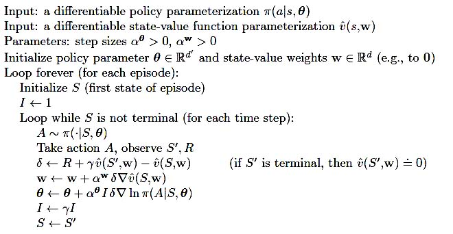

# vanilla_actorcritic
Basic actor-critic algorithm

usage: main.py [-h] [--env_name ENV_NAME] [--seed SEED]  
               [--hidden_size HIDDEN_SIZE]  
               [--max_episode_nums MAX_EPISODE_NUMS] [--max_steps MAX_STEPS]  
               [--gamma GAMMA] [--save_model]  
               [--load_model LOAD_MODEL] [--actor_act ACTOR_ACT]  
               [--critic_act CRITIC_ACT] [--noplot]  
               [--folder_name FOLDER_NAME] [--actor_lr ACTOR_LR]  
               [--critic_lr CRITIC_LR]
               
             

